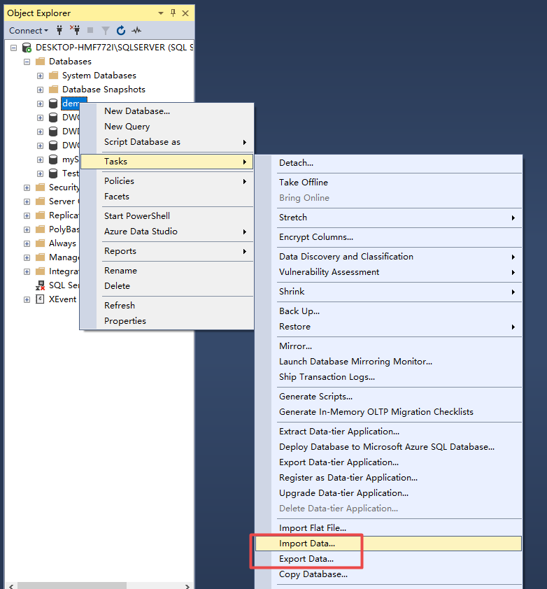

<p align="center">
 
 <h1 align="center">SQL Server</h2>
 <p align="center"><b>Based on Microsoft SQL Server 2019</b></p>
</p>


<div align=center>

[](LICENSE)


<div align=left>

[toc]

## 前言

### SQL Server 主要特性

- SQL Server 是一个**关系型数据库管理系统**
- 高性能设计，可充分利用 WindowsNT 的优势
- 系统管理先进，支持 Windows 图形化管理工具，支持本地和远程的系统管理和配置
- 强壮的事务处理功能，采用各种方法保证数据的完整性（事务：完成一个操作，所需要的完整步骤。比如 A 向 B 转账 1000人民币，操作是：A 扣除1000，B再增加1000.但如果A处理的时候宕机了，强壮的事务处理功能会回滚）
- 支持对称多处理器结构、存储过程、ODBC，并具有自主的 SQL 语言。SQLServer 以其内置的数据赋值功能、强大的管理工具、与 Internet 的紧密集成和开放的系统结构为广大的用户、开发人员和系统集成商提供了一个出众的数据库管理平台

### 语言运用

SQL语句可以用来执行各种各样的操作，例如更新数据库中的数据，从数据库中提取数据等。目前，绝大多数流行的关系型数据库管理系统，如 Oracle，Sybase，Microsoft SQL Server，Access 等都采用了 SQL 语言标准。虽然很多数据库都对SQL语句进行了再开发和扩展，但是包括 Select、Insert、Update、Delete、Create，以及 Drop 在内的标准的 SQL 命令仍然可以被用来完成几乎所有的数据库操作

### SLQ 语句入门

```sql
-- 在 SQL 中没有双引号 `" "`，所有的字符都使用单引号 `' '` 包含
print '1'						-- 输出：1
select 1						-- 

-- 任何类型的值都可以使用【单引号】包含
-- 首先 `+` 是一个算数运算符，只有 `+` 两边都是字符串时 `+` 才是一个连接符
-- 如果有一边是数值类型，那么系统就会做隐式类型转换，将可以转为数字的字符转数字，如果转不了就报错
print '1' + '2'					-- 输出：12
print 0 + '1' + '2'				-- 输出：3
print '2' + 3					-- 输出：5
print 'a' + 1					-- 报错，因为 `a` 转换不成字符（不会转为10，因为这里没有ASCII的概念）

-- 不区分大小写
print 'aaa'						-- 输出：aaa
pRint 'aaa'						-- 输出：aaa
Select * from Admin where name='a'-- 会把表中name为 a 和 A 的都一起输出

-- 没有 `==`，赋值和逻辑相等都是使用 `=`
if (1 = 1)
	print 'yes!'				-- 输出：yes!
```

- SQL 主要分 DDL、DML、DCL
  - DDL：数据定义语言，包括建表、建库等语句。
    - Create Table、Drop Table、Alter Table
  - DML：数据库操作语言。
    - Select、Insert、Update、Delete
  - DCL：数据库控制语言
    - Grant 授权、Revoke 取消授权

---

## 增、删、改、查

### CREATE 数据库的创建

创建模板：

```SQL
create database 数据库名称
on primary			-- 在哪个文件组上创建。默认在主文件组上创建（创建为主数据文件）并且 primary 可省略
(
-- 【逗号问题】什么时候末尾加逗号：当它不是一句可以单独执行的SQL命令 或 是一个结构中的某一句时
    name='逻辑名称_data',	-- 逻辑名称一般会有一个后缀，数据文件是`data`、日志文件是`log`
    filename='全路径',		-- 最后一句不加逗号；扩展名：`.mdf`
    size=初始大小,			-- 数值不应该包含在 '单引号' 之内
    maxsize=最大容量,
    fileGrowth=增长方式	-- 也不应该包含在 '单引号' 之内
)

log on
(
    name='逻辑名称_log',	-- 逻辑名称一般会有一个后缀，数据文件是`data`、日志文件是`log`
    filename='全路径',		-- 最后一句不加逗号；扩展名：`.ldf`
    size=初始大小,			-- 数值不应该包含在 '单引号' 之内
    maxsize=最大容量,
    fileGrowth=增长方式		-- 也不应该包含在 '单引号' 之内
)
```

代码示例：

```sql
-- 先切换当前数据库
use master

-------------------------------------------------------------------------
-- 先判断数据库是否存在，如果存在就先删除
if exists(select * from sysdatabases where name='TestSchool')	-- 【exists()】就是判断括号中的语句是否返回值，如果有值就返回 true，没值就是 false
DROP database TestSchool

-------------------------------------------------------------------------
go	-- 批处理级数的标记，表示上面的已经做完了

-------------------------------------------------------------------------
-- 自动创建文件夹											-- 【提权语句】sp_configure 显示或更改当前服务器的全局配置设置，执行成功返回0，失败返回1
execute sp_configure 'show advanced options',1			--  先开启外围应用配置管理器；1 代表开启；0 代表关闭
Reconfigure												--  RECONFIGURE使前面的配置生效
execute sp_configure 'xp_cmdshell',1
Reconfigure
execute xp_cmdshell 'mkdir D:\SQLServer\DataBase'		-- 调用存储过程 xp_cmdshell，让其帮我们创建一个文件夹 

-------------------------------------------------------------------------
-- 创建数据库 TestSchool
create database TestSchool
on primary
(
	name='TestSchool_data',
	filename='D:\SQLServer\db001_TestSchool\TestSchool_data.mdf',
	size=3mb,
	filegrowth=1mb,
	maxsize=100mb
),														-- 如果同时创建多个数据库，括号后面加逗号、
filegroup userDataBase									-- 【可选】选择文件组
(
	name='TestSchool2_data',
	filename='D:\SQLServer\db001_TestSchool\TestSchool2_data.ndf',		-- 【.ndf】次数据文件
	size=1mb,
	filegrowth=1mb,
	maxsize=10mb
)
log on
(
	name='TestSchool_log',
	filename='D:\SQLServer\db001_TestSchool\TestSchool_data.log',
	size=1mb,
	filegrowth=1%
	-- maxsize=100mb 日志一般不限制最大容量
),														-- 日志文件也可以有多个
(
	name='TestSchool2_log',
	filename='D:\SQLServer\db001_TestSchool\TestSchool_data2.log',
	size=1mb,
	filegrowth=1%
	-- maxsize=100mb 日志一般不限制最大容量
)

```


### CREATE 创建数据表

模板：

```SQL
Create Table 表名
(
	字段名称 字段类型 字段属性(是否为空 标识列 默认值 主键 唯一键 check约束),
    字段名称 字段类型 字段属性(是否为空 标识列 默认值 主键 唯一键 check约束),
    字段名称 字段类型 字段属性(是否为空 标识列 默认值 主键 唯一键 check约束),
)
```

代码示例：

```sql
-------------------------------------------------------------------------
-- 创建数据表（Teacher）ID Name Gender Age Salary Birthday
use TestSchool											-- 首先要指明所属的数据库
if exists(select * from sysobjects where name='Teacher') -- 查询表要用 sysobjects 关键字
	Drop table Teacher
go
create table Teacher
(
	ID int identity(1,1) primary key,					--【设置标识列】identity(标识种子,标识增量)，标识列就是用来做主键的！
	Name nvarchar(50) not null,								--【not null】标记字段不能为空，char类型没指定长度默认为 1 ！
	Gender bit not null,
	Age smallint check(age>=0 and age<=100) not null,	--【check】设置check约束
	Salary money,										-- 当一个字段可以为null时，可以写 null，也可以不写
	Birthday datetime not null default('2000-1-1')		--【default()】默认值
)

```


### CONSTRAINT 数据完整性

- **实体完整性**：表的每一行数据就称为一个实体，实体完整性是指每一行的记录是唯一的，不重复的
  - **标识列**：系统自动生成，永远不会重复
  - **主键**：唯一 非空，并且一个表的主键只有一个（但可以有复合主键）
  - **唯一键**：可以有多个唯一键，但是每类唯一键的内容不能重复，唯一键可以为null，只能空一次（设置：右键一个键 --> 索引/键 --> 添加 --> 修改名称为UQ_开头 (unique) --> 修改类型为唯一键(Unique Key) --> 确定哪个字段为唯一列 Columns那里）

- **域完整性**：域就是指字段，域完整性就是为了保证字段的值是合理且准确的
  - 非空、类型、check约束、默认值、关系（主外键约束）
- 【重点】**引用完整性**：一个表的某个字段的值引用自另外一个表的某一个字段。**被引用的表**就称为**主表**，引用别的表的那个表*（**引用表**）*就是***从表***或者外键表（FK - Foreign Key）
  - 选择外键表去创建主外键关系
  - 建立主外键关系的字段类型和意义必须一致！！！
  - **主表中所被对应的字段必须是唯一的！！**（主键或者唯一键）
  - 添加数据的时候，**先**添加**主表**的数据，***再***添加***外键表***
  - 删除数据的时候，*先*删除*外键表*的数据，**再**删除**主表**的数据

---

**关系建立的表的级联操作：**

- **不执行任何操作**：该报错就报错，能删除就删除
- **级联**：删除主表记录，对应的从表记录也将被删除
- **set null**：删除主表，从表中对应记录的字段值=null。前提是这个字段可以设置为null，不然会报错
- **set default**：删除主表，从表对应记录的字段值=设置的默认值。前提是这个字段已经设置了默认值

---

**用代码创建主键约束**

约束种类：

- 主键约束（PK-Primary Key）
- 唯一键约束（UQ-Unique）
- 检查约束（CK-Check）
- 默认值约束（DF-Default）
- 外键约束（FK-Foreign Key）

模板：

```sql
-------------------- 使用代码创建主键约束 --------------------
-- 约束种类：主键约束（PK-Primary Key）、唯一键约束（UQ-Unique）
-- 检查约束（CK-Check）、默认值约束（DF-Default）、外键约束（FK-Foreign Key）

-- 创建约束的语法
Alter table 表名
Add constraint 以简写为前缀的约束名称 约束类型 约束说明(字段 或 表达式 或 值)
```

实例代码：

```sql
-- 1. 将 ID 设置为主键
Alter table Teacher
Add constraint PK_Teacher_ID primary key(ID)


-- 2. 设置 name 为唯一键
if exists(select * from sysobjects where name='UQ_Teacher_Name')
	Alter table teacher Drop constraint UQ_Teacher_Name
Alter table Teacher
Add constraint UQ_Teacher_Name unique(Name)


-- 3. 设置年龄为 0~100 之间
Alter table Teacher
Add constraint CK_Teacher_Age check(Age>0 and Age <=100)


-- 4. 为 birthday 添加默认约束值
Alter table Teacher
Add constraint DF_Teacher_Birthday default('1990-1-1') for Birthday		-- for 是说明为哪一个字段添加默认值


-- 5. 为 class 添加外键约束
Alter table Teacher			-- 从表的某一个字段		引用			主表的某一个字段
with nocheck				-- 不检查现有数据
Add constraint FK_Teacher_Class foreign key(Class) references class(IdClass)
on delete set null 或者 default	-- 删除时外键表字段置为空或默认值
on update set null 或者 default	-- 更新时外键表字段置为空或默认值
```

### INSEART 数据插入

模板：

```sql
-- 数据插入
-- 语法：类似于C中的方法调用，顺序、数量和类型一一对应

insert [into] 表名(字段列表) values(值列表)
-- 说明：标识列值不管什么时候都不能插入值，同时插入的值与要满足表的所有完整性约束
```

代码示例及说明：

```sql
use TestSchool

-- 1. 为表的字段插入值，如果不指定字段列表，那么就默认要为所有字段插入值
insert into Teacher values('Tom1', 1, 1, 20, 5000, '1999-8-9')

-- 2. 值不能违反表的约束
insert into Teacher values('Tom2', 1, 1, 200, 5000, '1999-8-9')	-- ERROR：INSERT 语句与 CHECK 约束"CK_Teacher_Age"冲突

-- 3. 也可以只指定为那些列插入值
insert into Teacher(Name, Gender, Class, Birthday) values('Tom3', 0, 2, '2021-2-1')

-- 4. 非空字段一定要插入值，除非他有默认值
insert into Teacher(Name, Class) values('Tom4', 4)				-- 可以看到 not null 的 Birthday 被自动设为了默认值

-- 5. 如果一个字段可以为 null 或有默认值，那么在插入的时候也可以：为空字段赋值 null，默认值字段赋值 default
insert into Teacher values('Tom5', null, null, null, null, default)

-- 6. 所有的值都可以使用 '单引号' 包含：如果字段类型是数字，那么系统会自动做隐式类型转换
insert into Teacher values('Tom6', '1', '1', '69', '6666', '1999-8-9')

-- 7. 如果字符类型的字段没有使用 '单引号' 包含，那么：如果是非字符（ERROR），如果用纯数字（OK）
insert into Teacher values(7, '3', '0', '77', '6777', '1999-8-9')

-- 8. 如果日期值没有使用 '单引号' 包含，那么就会得到系统默认日期
insert into Teacher values(8, '3', '0', '77', '6777', 1999-8-9)	-- Birthday 被设置成了系统默认值（1905-06-06）
```

### UPDATE 数据更新

模板：

```sql
-- 数据更新
-- 语法：
update 表名 set 字段=值或表达式, 字段=值或表达式 where 条件(一般是能够做条件的是主键，唯一键，标识列)

```

代码示例：

```sql
-- 修改 Tom1 的班级为 3
-- update Teacher set Class=3 注意一定要加【where 条件】限定，不然会把表中所有的值都给改变！！
update Teacher set Class=3 where name='Tom1'

-- 修改 Tom6 的性别为女，并扣100工资
update Teacher set Gender=0, Salary-=1000 where name='Tom6'

-- 【多条件】判断多条件 not and or 性别是男 同时 是3班的，工资加666
update Teacher set Salary+=666 where Gender=1 and Class=3
```


### DELETE 数据删除

模板：

```sql
-- 语法：
delete [from] 表 where 条件
-- 1. 删除时一条一条的删除，每一次删除都会将操作写入到日志文件（效率低）
-- 2. 标识列的值不会从种子重新计算
-- 3. 可以触发触发器
```

代码示例：

```sql
-- 删除姓名为 7 的人
delete from Teacher where Name='7'

-- 多条件删除
delete from Teacher where Class='3' and Age<25

-- 【delete】删除【所有】数据
delete from Teacher
```

**删除所有数据**

```sql
-- 【delete】删除【所有】数据
delete from Teacher

-- 【truncate】删除【所有】数据
-- 1. 标识列从种子值重新计算
-- 2. 不可以触发触发器
-- 语法：
-- truncate table 表名（不能添加条件，因为他们不是一条一条的删除的，而是一次性删除所有记录，不关注删除的条数）
truncate table Teacher

-- 补充：公司里一般不回去直接去删除记录，而是用 update 做一个标记，标记此数据已经删除。但是其实没有删除
```

## SELECT 查询

### 单表查询

模板：

```sql
-- 单表查询数据索引
-- 语法：
select 字段列表或* from 表列表 where 条件
```

代码示例：

```sql
-- 查询所有信息
select * from Teacher

-- 查询指定列
select Id, Name, Salary, Class from Teacher

-- 指定查询条件：查询女老师
select * from Teacher where Gender=0 and Age<30

-- 【重点】为列指定中文别名，只改变结果集的显示，不会修改原始的表结构
select Id as 工号, Name 姓名, 工资=Salary, 公司='雪狸' from Teacher where Gender=0 and age<50

-- Select 可以输出，只不过输出的是以【表的形式】输出结果集
select 1+1, 2, 3, 4, 5
```

### top、distinct

```sql
select * from Student

-- 【Top】使用 Top 只返回结果集的前 n 条
select top 5 * from Student

-- 【Top n percent】使用 Top 只返回结果集的前 n% 条，不是四舍五入的，而是取 Ceiling（向上取整）
select top 10 percent * from Student


-- 【distinct】去除重复，作用与原始数据表的记录无关，只与当前结果集有关系
select distinct sex, Address from Student

```

### 聚合函数

```sql
-- 聚合函数
-- MAX(最大值)、MIN(最小值)、AVG(平均值)、SUM(和)、COUNT(数量：记录的数量)
-- SUM和AVG只能操作数值类型！比如日期、字符串不能做求和或平均值！
-- 这些函数都会自动过滤null！


select MAX(BornDate) from Student			-- 查询年龄最小的学员
select MIN(BornDate) from Student			-- 查询年龄最小的学员

select MIN(StudentName) from Student		-- 如果是字符串，按照字典序，得到最大或最小
select MAX(StudentName) from Student

select SUM(StudentResult) from Result where StudentNo=10	-- 查询学号是10学生的总分
select AVG(StudentResult) from Result where StudentNo=10	-- 查询学号是10学生的总分

select SUM(StudentResult) from Result where StudentNo=10	-- 查询学号是10学生的总分
select AVG(StudentResult) from Result where StudentNo=10	-- 查询学号是10学生的总分

-- COUNT 得到满足条件的记录数，会自动过滤null
select COUNT(StudentName) from Student		-- 学生总人数
```

### 条件查询

```sql
-- 【where】带条件的查询
select * from Student where Sex='女'


-- 查询年龄在 15-20之间的女性
select * from Student where Sex='女' and BornDate>'1995-1-1' and BornDate<'1999-1-1'

-- 【between ... and ...】大于等于前面的值，小于等于后面
select * from Student where Sex='女' and BornDate between'1995-1-1' and '1999-1-1'


-- 查询1~4班的学员信息
select * from Student where ClassID=1 or ClassID=2 or ClassID= 3 or ClassID=4

--【in】可以指定一个具体的范围，他可以取其中任意的值。【注意】括号里的值必须和前面的 ClassId 一致！！如果类型不一致并且程序无法隐式转换就会报错
select * from Student where ClassId in (1,2,3,4)
```

### 模糊查询

```sql
-- 模糊查询
-- 【like '条件'】使用模糊查询匹配单引号里面的
-- 【not like '条件'】匹配除了单引号里面的


-- 通配符：
--【%】匹配任意多个任意字符
--【_】匹配任意一个字符
--【[]】代表一个具体的范围，能够匹配其中一个字符
--【^】取反值，只有在[]中才有意义！

use CZSchool
-- 查询姓“林”的同学
-- 【=】代表严格的字符串匹配，所以%只是一个字符而已，如果他是通配符必须使用【like】
select * from Student where StudentName='林%'
select * from Student where StudentName like '林%'
select * from Student where StudentName like '林__'

-- 查询【不】姓“林”的同学
select * from Student where StudentName not like '林%'

-- 查询学号为 11~15 的学生
select * from Student where StudentNo like '1[12345]'
select * from Student where StudentNo like '1[1-5]'
select * from Student where StudentNo like '[11-15]'	-- 【ERROR】系统会识别为 1 1-1 5，所以只会输出学号为1和5的，这里和正则一样，方括号里只能填0-9 a-z A-Z！
select * from Student where StudentNo like '1[^1-5]'	-- 输出学号为10、16~19的
```

查询练习：

```sql
-- 1. 查询六期班中所有姓“周”的学员
select classid from grade where classname='六期班'		<-- 这样可以查出（返回）六期班的ID
select * from Student where StudentName like '周%' and ClassId=(select classid from grade where classname='六期班')

-- 查询所有科目中包含 c 字符的科目信息
select * from Subject where SubjectName like '%c%'

-- 查询 office 最近一次考试时间
select MAX(ExamDate) from Result where SubjectId=(select SubjectId from Subject where SubjectName='office')


```


### 空值处理

- 数据库中一个列没有指定值，那么值就是 `null`，数据库中 `null` 表示**不知道**，而不是表示没有。因为 `select null + 1`结果还是 null，因为 `不知道 + 1` 还是不知道
- 注意：数据中中的 `null` 和 C#中的 `null` 不一样！！

```sql
-- 查询没有电子邮箱的学员信息
select * from Student where Email is null

update Student set Email=null where StudentNo=9

select * from Student where Email is not null

-- 【ISNULL】ISNULL如果发现对应值是NULL值，则以指定文本进行替换【只是做一个结果集的替换，并没有修改源数据】
select StudentNo, StudentName, ISNULL(Email, '没有填写') from Student
```


### 数据排序

```sql
-- 格式：select 字段列表 from 表列表 where 条件 order by (排序字段列表)对结果集进行记录重排
-- 排序不会修改结果集的数据，只是对结果集数据的重排
-- 【desc】降序，【asc】代表升序
-- 【注意】order by 必须总是防在最后！！！
select * from Student where sex='女' order by BornDate desc, StudentNo asc
```


### 分组统计

```sql
-- 数据分组-统计信息
select top/distinct 字段列表 from 表列表 where 源数据筛选条件 group by 分组字段列表 having 对分组之后得到的结果集做筛选 order by 排序字段列表

-- 查询男女生人数
select COUNT(*) from Student
select COUNT(*) from Student where sex='男'

select COUNT(*) from Student group by sex
select sex,COUNT(*) from Student group by Sex

-- 查询每一个班级的总人数
-- 【重点】与聚合函数一起出现在select后面一起查询的列，只有两种可能性：被聚合 被分组
select Classid, COUNT(*) from student group by ClassId

-- 查询每一个班的男女生总人数
select classid, sex, COUNT(*) from student group by ClassId, sex order by ClassId, sex

-- 查询每一个班级男女生的人数，同时只显示人数数量超过3人的记录
--  5   7                                    1             2                       3                    4                    6
select top 2 ClassId, sex, COUNT(*) as cnt from student where email is not null group by ClassId, sex having count(*)>3 order by Classid

```

## SELECT  子查询

### SELECT  独立子查询

```SQL
-- 子查询：
--		在一个查询中包含另一个查询，被包含的查询就被称为子查询；包含子查询的查询就被称为父查询

-- 查询比冯晨旭年龄大的学员信息
USE CZSchool
SELECT BornDate FROM Student WHERE StudentName='冯晨旭'
SELECT * FROM Student WHERE BORNDATE < (SELECT BornDate FROM Student WHERE StudentName='冯晨旭')

-- 查询七期班的学员信息
SELECT * FROM STUDENT WHERE ClassId=
	(
		SELECT ClassId FROM grade WHERE classname='七期班'
	)
```

### SELECT 相关子查询

```sql
-- 相关子查询：子查询中引用了父查询的结果
USE CZSchool
	SELECT * FROM Student WHERE StudentNo=
	(
		SELECT DISTINCT StudentNo FROM Result WHERE StudentNo=Student.StudentNo
	)
```

## JOIN 表连接

### 


## 逻辑语句

### CASE

```sql
-- 100 - CASE用法

-- 1. 用来做结果集【字段】值的替换
-- 2. 生成新列
-- 3. 相当于 switch...case 和 is..else


-- 第1种使用的方法：
-- CASE 表达式/字段
-- WHEN 值 THEN 自定义值
-- ....
-- ELSE 如果上面的 WHEN 都不满足就满足 ELSE
-- END

use CZSchool
select StudentNo, Studentname, Sex, ClassId from Student

-- 如果 CASE 后面接表达式或者字段，那么这种结构【只能做等值判断】
select StudentNo, Studentname, Sex,
		CASE ClassId
			WHEN 1 THEN '一班'
			WHEN 1 THEN '二班'
			WHEN 1 THEN '三班'
			ELSE '我不晓得'
		END AS '班级名称'
	FROM Student


-- 第2种使用的方法：
-- CASE 如果 CASE 后面没有接表达式或者值，那么相当于IF ELSE
-- WHEN 值 THEN 自定义值
-- ....
-- ELSE 如果上面的 WHEN 都不满足就满足 ELSE
-- END

SELECT StudentNo, StudentName,
		CASE  -- 会从上往下匹配
			WHEN BornDate > '2000-1-1' then '小正太'
			WHEN BornDate > '1990-1-1' then '小青年'
			WHEN BornDate > '1980-1-1' THEN '大叔'
			-- WHEN Sex='男' then '我是男的'
			ELSE '中老年'
		END
	FROM Student

```


## CONVERT 类型转换函数

```sql
-- 类型转换函数 --
print 1 + 'a'
print '我的分数是：' + 100

-- cast(原值 as 目标类型)
print '我的分数是：' + cast(100 as char(3))

-- convert(目标类型, 源数据, [格式]) <--格式是相对于【日期值】而言
print '我的分数是：' + convert(char(3), 100)

print '我的生日是：' + convert(char(20), getdate(), 101)
```

## UNION 合并结果集 一次性插入多条记录

```sql
-- 联合(union) 和 连接（join)不一样

use master
use CZSchool

-- 查询男女生总人数
select '男生人数', COUNT(*) from Student where Sex='男'
select '女生人数', COUNT(*) from Student where Sex='女'

-- union:是用来联合多个结果集的
-- 1. 要求联合的多个结果集有相同数量的字段
-- 2. 要求联合的多个结果集对应的列的类型需要一致：所谓的类型一致是指他们可以互相转换
-- union 默认是去除重复的，效率低，是因为需要为你做是否重复的判断
-- union all 就是不去除重复
select '男生人数', COUNT(*) from Student where Sex='男'
union
select '女生人数', COUNT(*) from Student where Sex='女'

select '男生人数', COUNT(*) from Student where Sex='男'
union all
select '男生人数', COUNT(*) from Student where Sex='男'


-- 使用union，一次性插入多条数据
-- union 还是可以去除重复记录，只有当全部都使用 union all 才不考虑重复值
insert into Admin
select 'fox', 'fox' union all
select 'fox', 'fox' union
select 'fox2', 'fox2'


-- select into from：可以将 from 数据源表中 select 指定的列的数据 into 到新表中（表结构保持一致），新表是系统自动生成的，不能人为先创建，也就是之前不能存在
select * into newtable from Student
delete from newtable
select top 0 * newttt from Student		-- 【重点】只要一个表结构，但只保留null/not null 主键，其他的都没有了

-- insert into 表 selete from：可以将select查询语句中获取的数据into到指定表，【表需要先存在】
insert into newtable select Studentname,Loginpwd, sex, classid, phone, address, borndate, email, isDel from Student


```


## 函数

### 字符串函数


```sql
-- 字符串函数
-- charindex --indexof：查询指定字符在源字符串中出现的起始位置，位置从1开始计算，如果找不到就返回0
-- 参数1：需要查询的字符串	参数2：源字符串	参数3：指定查询的起始位置
select CHARINDEX('冰糖', '一只神奇的冰糖雪狸', 4)

-- Len（） 得到指定字符串长度
select LEN('一只神奇的冰糖雪狸')

-- upper() 全部转大写
-- lower() 全部转小写
select upper('лллииисссааа')

-- Ltrim() 去除左空格
-- Rtrim() 去除右空格
select LTRIM('         一只神奇的冰糖雪狸          ') + '123'
select rtrim('         一只神奇的冰糖雪狸          ') + '123'
select ltrim(RTRIM('         一只神奇的冰糖雪狸          ')) + '123'

-- right() 可以从指定的字符串右边开始返回指定数目的字符串。数量可以指定任意正值，但不能是负值
select RIGHT('一只神奇的冰糖雪狸', 4)
select LEFT('一只神奇的冰糖雪狸', 2)

-- substring('字符串', n, m) 从索引n开始，匹配m个字符
select SUBSTRING('一只神奇的冰糖雪狸', CHARINDEX('神奇', '一只神奇的冰糖雪狸'), 5)


-- replace() 替换
select REPLACE('一只神奇的冰糖雪狸', '冰糖雪狸', 'silverfox')

-- stuff('源字符串', 起始位置n, m个字符, '替换为我')  
select STUFF('一只神奇的冰糖雪狸', 3, 2, 'Magical')

```


### 数值函数

```sql
-- 数值函数
-- rand() 生成一个 [0, 1) 之间的随机数
select RAND()

-- abs() absolute 绝对值
select abs(-233)

-- ceiling() 向上取整，获取比当前数大的最小整数，通常用与分页功能
select CEILING(0.0001)	-- 1

-- floor() 向下取整，获取比当前数小的最大整数
select FLOOR(0.0001)	-- 0

-- round(数值， 尽到小数后几位) 
select ROUND(3.1415, 3)	-- 3.1420
select ROUND(4.5, 0)	-- 5.0
select ROUND(4.6444, 1)	-- 4.6000

-- sign() 正数输出1；负数输出-1；0输出0
select SIGN(233)	-- 1
select SIGN(-233)	-- -1

-- power() 平方
select POWER(2, 3)	-- 8

--sqrt() 开平方
select SQRT(8)		-- 2.82842712474619
```

### 日期函数

```sql
-- 日期函数

-- getdate() 获取当前系统日期
select GETDATE()

-- dateadd() 在指定的日期值上增加指定的日期值
select DATEADD(mm, 3, GETDATE())
select DATEADD(dd, 40, GETDATE())
select DATEADD(mm, -5, GETDATE()) -- 三个月之前是哪一天

-- datediff() 获取两个指定日期之间的日期值
select StudentName, DATEDIFF(yyyy, BornDate, GETDATE()) from student
-- 查询年龄在 14~29 之间的男生
select StudentName, Phone, Address from Student where DATEDIFF(yyyy, BornDate, GETDATE()) between 14 and 29 and sex='男'
select DATEDIFF(mm, '2019-9-1', GETDATE())

-- datename() 返回日期的【字符串】
select DATENAME(yyyy, getdate())
select DATENAME(ww, getdate())	-- 现在是今年的第几周
select DATENAME(WEEKDAY, GETDATE())	-- 今天是星期几

-- datepart() 得到日期指定部分
select DATEPART(yyyy, GETDATE())
```


## Transact-SQL 修改

- 数据库名称修改

  ```sql
  ALTER(改变) database testdb01
  MODIFY(修改) name=testdb02;
  ```

  

- 对数据库**文件属性**修改

  ```sql
  ALTER database testbd
  MODIFY FILE(
  	name=testdt,
  	size=20MB,
      maxsize=80MB,
      filegrowth=10MB
  );
  ```

  

- 数据库查看的帮助（不属于修改）

  借助这个命令可以查看是否修改成功

  ```sql
  EXEC SP_HELPDB TESTDB;
  ```

  

## Transact-SQL 删除

```sql
DROP(删除) datebase sales, newsales;
```

## 各种char的对比

首先创建表 CharTest（下表）

| char(10) | varchar(10) | nchar(10) | nvchar(10) |
| -------- | ----------- | --------- | ---------- |
| aa       | aa          | aa        | aa         |

借助指令查看大小及长度

```sql
-- 这是一行注释，以“--”开头
-- Len(参数) 可以查看字符串的字符数量
-- DataLength() 计算指定参数的所占据的字节长度。英文1字节，中文2字节

-- char 每个字符占1字节，当储存的字符数量小于指定的容量时，容量【不会】收缩；大于指定容量时会报错（截断二进制数据）
select Len(char) from chatTest			-- 输出：2
select DataLength(char) from charTest	-- 输出：10

-- varchar 每个字符占1字节，“var”代表可变的，说明分配的容量是一个可以动态变化的空间。当存储的字符数小于分配的容量时，多余的容量会自动回收；大会指定的容量还是会报错
select Len(varchar) from chatTest			-- 输出：2
select DataLength(varchar) from charTest	-- 输出：2

-- nchar 每个字符占【2】字节，因为其保存的是Unicode，其开头的n也代表了Unicode；容量不会自动收缩；大于会报错
select Len(varchar) from chatTest			-- 输出：2
select DataLength(varchar) from charTest	-- 输出：【20】

-- nvarchar 
select Len(nvarchar) from chatTest			-- 输出：2
select DataLength(nvarchar) from charTest	-- 输出：【4】收缩了，且一个字符2字节
```


## 数据库的分离和附加

分离就好比数据库的删除，分离之后才能在资源管理器中对数据库进行拷贝、删除等操作

- 分离（相当于离婚）

  

  

- 脱机（相当于吵架分家）

  

- 联机

  

- 附加

  

## 数据的导出和导入

可以将数据库导出为Excel或者txt文件（平面目标文件）

或者以为Excel或者txt文件导入为数据库




## 用户权限


---

## 身份验证访问

### 安全主体 Субъекты безопасности

安全主体是使用 SQL Server 并可以为其分配执行操作的权限的标识的正式名称。 它们通常是人员或人员组，但可以是伪装成人员的其他实体。 安全主体可以使用列出的 Transact-SQL 或通过使用 SQL Server Management Studio来进行创建和管理

---

#### 登录名 Имена входа

登录名是用于登录到 SQL Server 数据库引擎的单个用户帐户。 SQL Server 和 SQL 数据库 支持基于 Windows 身份验证的登录名和基于 SQL Server 身份验证的登录名。 

---

#### 固定服务器角色 Предопределенные роли сервера

В SQL Server предопределенные роли сервера — это **набор предварительно настроенных ролей**, который представляет собой удобную группу разрешений на уровне сервера.

在 SQL Server 中，固定服务器角色是一组预配置的角色，便于对服务器级别权限进行分组。 可以使用 `ALTER SERVER ROLE ... ADD MEMBER` 语句将登录名添加到角色。 SQL 数据库 不支持固定服务器角色，但在 master 数据库中有两个角色（`dbmanager` 和 `loginmanager`）充当服务器角色。

---

#### 用户定义的服务器角色 Определяемые пользователем роли сервера

Именам входа доступ к базе данных предоставляется путем создания пользователя базы данных в базе данных и сопоставления этого пользователя базы данных с именем входа. Как правило, имя пользователя базы данных совпадает с именем входа, хотя это и необязательно. 

在 SQL Server中，可以创建你自己的服务器角色并向它们分配服务器级权限。 可以使用 `ALTER SERVER ROLE ... ADD MEMBER` 语句将登录名添加到服务器角色。

---

#### 数据库用户 Пользователи базы данных

通过在数据库中创建数据库用户并将该数据库用户映射到登录名来授予登录名对数据库的访问权限。 通常，数据库用户名与登录名相同，尽管它不必要相同。 每个数据库用户均映射到单个登录名。 一个登录名只能映射到数据库中的一个用户，但可以映射为多个不同数据库中的数据库用户。

也可以创建不具有相应登录名的数据库用户。 这些数据库用户称为“包含的数据库用户” 。 Microsoft 鼓励使用包含的数据库用户，因为这样可以更轻松地将你的数据库移到另一个服务器。

---

#### 固定数据库角色 Предопределенные роли базы данных

Предопределенные роли базы данных — это набор предварительно настроенных ролей, который представляет собой удобную группу разрешений на уровне базы данных

固定数据库角色是一组预配置的提供方便的数据库级权限组的角色。 可以使用 `ALTER ROLE ... ADD MEMBER` 语句将数据库用户和用户定义的数据库角色添加到固定数据库角色。 有关详细信息，请参阅 [ALTER ROLE (Transact-SQL)](https://docs.microsoft.com/zh-cn/sql/t-sql/statements/alter-role-transact-sql?view=sql-server-ver15)。

---

#### 用户定义的数据库角色

具有 `CREATE ROLE` 权限的用户可以创建新的用户定义的数据库角色来表示具有常用权限的用户组。 通常对整个角色授予或拒绝权限，从而简化了权限管理和监视。 可以使用 `ALTER ROLE ... ADD MEMBER` 语句向数据库角色添加数据库用户。 有关详细信息，请参阅 [ALTER ROLE (Transact-SQL)](https://docs.microsoft.com/zh-cn/sql/t-sql/statements/alter-role-transact-sql?view=sql-server-ver15)。

---

### 主体（数据库引擎）Субъекты 

> **主体** - 可以看作是一个最小单位，它不能够再次进行分割

#### 数据库级的主体

- 数据库用户（有 12 个类型的用户。 有关详细信息，请参阅 [CREATE USER](https://docs.microsoft.com/zh-cn/sql/t-sql/statements/create-user-transact-sql?view=sql-server-ver15)。）
- 数据库角色
- 应用程序角色

---

### 服务器级别角色 Роли уровня сервера

SQL Server 提供**==服务器==级角色**以帮助你管理服务器上的权限。 这些角色是可组合其他主体的安全主体。 **服务器级角色的权限作用域为服务器范围。 （“角色”类似于 Windows 操作系统中的“组”）**

SQL Server 提供了九种固定服务器角色。 无法更改授予固定服务器角色（public 角色除外）的权限。 从 SQL Server 2012 (11.x)开始，**您可以创建用户定义的服务器角色，并将服务器级权限添加到用户定义的服务器角色。**

你可以将服务器级主体（SQL Server 登录名、Windows 帐户和 Windows 组）添加到服务器级角色。 固定服务器角色的每个成员都可以将其他登录名添加到该同一角色。 **用户定义的服务器角色的成员则无法将其他服务器主体添加到角色。**

#### 服务器级的固定角色 Предопределенные роли уровня сервера

| 服务器级的固定角色 | 说明                                                         |
| :----------------- | :----------------------------------------------------------- |
| **sysadmin**       | sysadmin 固定服务器角色的成员可以在服务器上**执行任何活动**。 |
| **serveradmin**    | **serveradmin** 固定服务器角色的成员可以**更改服务器范围的配置选项和关闭服务器**。 |
| **securityadmin**  | **securityadmin** 固定服务器角色的成员可以**管理登录名及其属性**。 **他们可以 `GRANT`、`DENY` 和 `REVOKE` 服务器级权限。** 他们还可以 `GRANT`、`DENY` 和 `REVOKE` 数据库级权限（如果他们具有数据库的访问权限）。 此外，他们还可以重置 SQL Server 登录名的密码。  **重要提示：** 如果能够授予对 数据库引擎 的访问权限和配置用户权限，安全管理员可以分配大多数服务器权限。 **securityadmin** 角色应视为与 **sysadmin** 角色等效。 |
| **processadmin**   | processadmin 固定服务器角色的成员可以**终止在 SQL Server 实例中运行的进程**。 |
| **setupadmin**     | setupadmin 固定服务器角色的成员可以使用 Transact-SQL 语句**添加和删除链接服务器**。 （使用 Management Studio 时需要 sysadmin 成员资格。） |
| **bulkadmin**      | bulkadmin 固定服务器角色的成员**可以运行 `BULK INSERT` 语句** *（在SQL Server中，BULK INSERT是用来将外部文件以一种特定的格式加载到数据库表的T-SQL命令。 ）*。  Linux 上的 SQL Server 不支持 bulkadmin 角色或管理大容量操作权限。 只有 sysadmin 才能对 Linux 上的 SQL Server 执行批量插入。 |
| **diskadmin**      | diskadmin 固定服务器角色用于**管理磁盘文件**。               |
| **dbcreator**      | **dbcreator** 固定服务器角色的成员可以**创建、更改、删除和还原任何数据库**。 |
| **public**         | **每个 SQL Server 登录名都属于 public 服务器角色**。 如果未向某个服务器主体授予或拒绝对某个安全对象的特定权限，该用户将继承授予该对象的 public 角色的权限。 只有在希望所有用户都能使用对象时，才在对象上分配 Public 权限。 你无法更改具有 Public 角色的成员身份。  注意：public 与其他角色的实现方式不同，可通过 public 固定服务器角色授予、拒绝或撤销权限 。 |


下表介绍了可以用于服务器级角色的命令、视图和功能。

| Feature                                                      | 类型    | 说明                                                         |
| :----------------------------------------------------------- | :------ | :----------------------------------------------------------- |
| [sp_helpsrvrole (Transact-SQL)](https://docs.microsoft.com/zh-cn/sql/relational-databases/system-stored-procedures/sp-helpsrvrole-transact-sql?view=sql-server-ver15) | 元数据  | 返回服务器级角色的列表。                                     |
| [sp_helpsrvrolemember (Transact-SQL)](https://docs.microsoft.com/zh-cn/sql/relational-databases/system-stored-procedures/sp-helpsrvrolemember-transact-sql?view=sql-server-ver15) | 元数据  | 返回有关服务器级角色成员的信息。                             |
| [sp_srvrolepermission (Transact-SQL)](https://docs.microsoft.com/zh-cn/sql/relational-databases/system-stored-procedures/sp-srvrolepermission-transact-sql?view=sql-server-ver15) | 元数据  | 显示服务器级角色的权限。                                     |
| [IS_SRVROLEMEMBER (Transact-SQL)](https://docs.microsoft.com/zh-cn/sql/t-sql/functions/is-srvrolemember-transact-sql?view=sql-server-ver15) | 元数据  | 指示 SQL Server 登录名是否为指定服务器级角色的成员。         |
| [sys.server_role_members (Transact-SQL)](https://docs.microsoft.com/zh-cn/sql/relational-databases/system-catalog-views/sys-server-role-members-transact-sql?view=sql-server-ver15) | 元数据  | 为每个服务器级角色的每个成员返回一行。                       |
| [CREATE SERVER ROLE (Transact-SQL)](https://docs.microsoft.com/zh-cn/sql/t-sql/statements/create-server-role-transact-sql?view=sql-server-ver15) | Command | **创建用户定义的服务器角色。**                               |
| [ALTER SERVER ROLE (Transact-SQL)](https://docs.microsoft.com/zh-cn/sql/t-sql/statements/alter-server-role-transact-sql?view=sql-server-ver15) | Command | **更改服务器角色的成员关系或更改用户定义的服务器角色的名称。** |
| [DROP SERVER ROLE (Transact-SQL)](https://docs.microsoft.com/zh-cn/sql/t-sql/statements/drop-server-role-transact-sql?view=sql-server-ver15) | Command | **删除用户定义的服务器角色。**                               |
| [sp_addsrvrolemember (Transact-SQL)](https://docs.microsoft.com/zh-cn/sql/relational-databases/system-stored-procedures/sp-addsrvrolemember-transact-sql?view=sql-server-ver15) | Command | 将登录名添加为某个服务器级角色的成员。 已弃用。 应改用 [ALTER SERVER ROLE](https://docs.microsoft.com/zh-cn/sql/t-sql/statements/alter-server-role-transact-sql?view=sql-server-ver15) 。 |
| [sp_dropsrvrolemember (Transact-SQL)](https://docs.microsoft.com/zh-cn/sql/relational-databases/system-stored-procedures/sp-dropsrvrolemember-transact-sql?view=sql-server-ver15) | Command | 从服务器级角色中删除 SQL Server 登录名或 Windows 用户或组。 已弃用。 应改用 [ALTER SERVER ROLE](https://docs.microsoft.com/zh-cn/sql/t-sql/statements/alter-server-role-transact-sql?view=sql-server-ver15) 。 |

---


### 数据库级别的角色 Роли уровня базы данных

为便于管理**数据库**中的权限， SQL Server 提供了若干“角色” ，这些角色是用于对其他主体进行分组的安全主体。 它们类似于 ***Windows 操作系统中的*** 组 Microsoft 。 **==数据库级角色==的权限作用域为==数据库范围==**。

若要向数据库角色添加和删除成员，请使用 `ADD MEMBER` ALTER ROLE `DROP MEMBER` 语句的 [和](https://docs.microsoft.com/zh-cn/sql/t-sql/statements/alter-role-transact-sql?view=sql-server-ver15) 选项。

存在两种类型的数据库级角色：数据库中预定义的“固定数据库角色”和可以创建的“用户定义的数据库角色”。

固定数据库角色是在数据库级别定义的，并且存在于每个数据库中。 **db_owner** 数据库角色的成员可以管理固定数据库角色成员身份。 msdb 数据库中还有一些特殊用途的数据库角色。

可以向数据库级角色中添加任何数据库帐户和其他 SQL Server 角色。

**固定数据库角色 предопределенные роли базы данных**

| 固定数据库角色名      | 说明                                                         |
| :-------------------- | :----------------------------------------------------------- |
| **db_owner**          | **db_owner** 固定数据库角色的成员可以执行数据库的**所有配置和维护活动**，还可以**删除** SQL Server 中的**数据库**。 （在 SQL 数据库 和 Synapse Analytics 中，某些维护活动需要服务器级别权限，并且不能由 db_owners 执行。） |
| **db_securityadmin**  | db_securityadmin 固定数据库角色的成员可以**仅**修改自定义角色的**角色成员资格和管理权限**。 此角色的成员可能会提升其权限，应监视其操作。 |
| **db_accessadmin**    | **db_accessadmin** 固定数据库角色的成员可以为 Windows 登录名、Windows 组和 SQL Server **登录名添加或删除数据库访问权限**。 |
| **db_backupoperator** | **db_backupoperator** 固定数据库角色的成员可以**备份数据库**。 |
| **db_ddladmin**       | **db_ddladmin** 固定数据库角色的成员可以在数据库中**运行任何数据定义语言 (DDL) 命令**。（DDL命令创建或删除数据库，DML添加，移动或更改数据） |
| **db_datawriter**     | **db_datawriter** 固定数据库角色的成员可以在**所有用户表中添加、删除或更改数据**。 |
| **db_datareader**     | db_datareader 固定数据库角色的成员可以**从所有用户表和视图中读取所有数据**。 用户对象可能存在于除 sys 和 INFORMATION_SCHEMA 以外的任何架构中 。 |
| **db_denydatawriter** | db_***deny***data**writer** 固定数据库角色的成员**不能添加、修改或删除数据库内用户表中的任何数据**。 |
| **db_denydatareader** | db_***deny***data**reader** 固定数据库角色的成员**不能读取数据库内用户表和视图中的任何数据**。 |

无法更改分配给固定数据库角色的权限。 下图显示了分配给固定数据库角色的权限：


下表说明了用于数据库级角色的命令、视图和函数。

| Feature                                                      | 类型     | 说明                                                         |
| :----------------------------------------------------------- | :------- | :----------------------------------------------------------- |
| [sp_helpdbfixedrole (Transact-SQL)](https://docs.microsoft.com/zh-cn/sql/relational-databases/system-stored-procedures/sp-helpdbfixedrole-transact-sql?view=sql-server-ver15) | 元数据   | 返回固定数据库角色的列表。                                   |
| [sp_dbfixedrolepermission (Transact-SQL)](https://docs.microsoft.com/zh-cn/sql/relational-databases/system-stored-procedures/sp-dbfixedrolepermission-transact-sql?view=sql-server-ver15) | 元数据   | 显示固定数据库角色的权限。                                   |
| [sp_helprole (Transact-SQL)](https://docs.microsoft.com/zh-cn/sql/relational-databases/system-stored-procedures/sp-helprole-transact-sql?view=sql-server-ver15) | 元数据   | 返回当前数据库中有关角色的信息。                             |
| [sp_helprolemember (Transact-SQL)](https://docs.microsoft.com/zh-cn/sql/relational-databases/system-stored-procedures/sp-helprolemember-transact-sql?view=sql-server-ver15) | 元数据   | 返回有关当前数据库中某个角色的成员的信息。                   |
| [sys.database_role_members (Transact-SQL)](https://docs.microsoft.com/zh-cn/sql/relational-databases/system-catalog-views/sys-database-role-members-transact-sql?view=sql-server-ver15) | 元数据   | 为每个数据库角色的每个成员返回一行。                         |
| [IS_MEMBER (Transact-SQL)](https://docs.microsoft.com/zh-cn/sql/t-sql/functions/is-member-transact-sql?view=sql-server-ver15) | 元数据   | 指示当前用户是否为指定 Microsoft Windows 组或 Microsoft SQL Server 数据库角色的成员。 |
| [CREATE ROLE (Transact-SQL)](https://docs.microsoft.com/zh-cn/sql/t-sql/statements/create-role-transact-sql?view=sql-server-ver15) | Command  | 在当前数据库中创建新的数据库角色。                           |
| [ALTER ROLE (Transact-SQL)](https://docs.microsoft.com/zh-cn/sql/t-sql/statements/alter-role-transact-sql?view=sql-server-ver15) | Command  | 更改数据库角色的名称或成员身份。                             |
| [DROP ROLE (Transact-SQL)](https://docs.microsoft.com/zh-cn/sql/t-sql/statements/drop-role-transact-sql?view=sql-server-ver15) | Command  | 从数据库中删除角色。                                         |
| [sp_addrole (Transact-SQL)](https://docs.microsoft.com/zh-cn/sql/relational-databases/system-stored-procedures/sp-addrole-transact-sql?view=sql-server-ver15) | Command  | 在当前数据库中创建新的数据库角色。                           |
| [sp_droprole (Transact-SQL)](https://docs.microsoft.com/zh-cn/sql/relational-databases/system-stored-procedures/sp-droprole-transact-sql?view=sql-server-ver15) | Command  | 从当前数据库中删除数据库角色。                               |
| [sp_addrolemember (Transact-SQL)](https://docs.microsoft.com/zh-cn/sql/relational-databases/system-stored-procedures/sp-addrolemember-transact-sql?view=sql-server-ver15) | Command  | 为当前数据库中的数据库角色添加数据库用户、数据库角色、Windows 登录名或 Windows 组。 除 Analytics Platform System (PDW) 和 Azure Synapse 外，所有平台都应改为使用 `ALTER ROLE` 。 |
| [sp_droprolemember (Transact-SQL)](https://docs.microsoft.com/zh-cn/sql/relational-databases/system-stored-procedures/sp-droprolemember-transact-sql?view=sql-server-ver15) | Command  | 从当前数据库的 SQL Server 角色中删除安全帐户。 除 Analytics Platform System (PDW) 和 Azure Synapse 外，所有平台都应改为使用 `ALTER ROLE` 。 |
| [GRANT](https://docs.microsoft.com/zh-cn/sql/t-sql/statements/grant-transact-sql?view=sql-server-ver15) | **权限** | **向角色添加权限。**                                         |
| [DENY](https://docs.microsoft.com/zh-cn/sql/t-sql/statements/deny-transact-sql?view=sql-server-ver15) | **权限** | **拒绝向角色授予权限。**                                     |
| [REVOKE](https://docs.microsoft.com/zh-cn/sql/t-sql/statements/revoke-transact-sql?view=sql-server-ver15) | **权限** | **撤消以前授予或拒绝的权限。**                               |

### 应用程序角色 Роли приложений

应用程序角色是一个数据库主体，它使应用程序能够用其自身的、类似用户的权限来运行。 使用应用程序角色，可以只允许通过特定应用程序连接的用户访问特定数据。 与数据库角色不同的是，应用程序角色默认情况下不包含任何成员，而且是非活动的。 可以使用 **sp_setapprole** 启用应用程序角色，该过程需要密码。 因为应用程序角色是数据库级主体，所以它们只能通过其他数据库中为 **guest** 授予的权限来访问这些数据库。 因此，其他数据库中的应用程序角色将无法访问任何已禁用 **guest** 的数据库。

在 SQL Server中，应用程序角色无法访问服务器级元数据，因为它们不与服务器级主体关联。 若要禁用此限制，从而允许应用程序角色访问服务器级元数据，请设置全局标志 4616。 有关详细信息，请参阅[跟踪标志 (Transact-SQL)](https://docs.microsoft.com/zh-cn/sql/t-sql/database-console-commands/dbcc-traceon-trace-flags-transact-sql?view=sql-server-ver15) 和 [DBCC TRACEON (Transact-SQL)](https://docs.microsoft.com/zh-cn/sql/t-sql/database-console-commands/dbcc-traceon-transact-sql?view=sql-server-ver15)。


## ADO

### 简介

ADO 就是一个类库，可以通过搭建界面让用户方便的操纵数据库。

### ADO.NET 的组成


1. 第一部分：数据提供程序（常用类）

   - Connection（连接通道），用来**连接**数据库
   - Command（命令对象），用来执行SQL语句（增删改、查询**单个值**）
   - **DataReader（数据读取器）**：**只读、只进**的结果集，一条一条读取数据（StreamReader 微软的类库中这些 Reader 的使用方式都差不多）

2. 第二部分：数据集（DataSet），临时数据库——放**服务器**内存中

   

   - 断开式数据操作

### ADO.Net 访问数据库的方式

1. 直接访问服务器
   1. 连接数据用 Connection
   2. 执行 SQL 语句 Command
   3. 执行完成后将结果一条一条的返回。DataReader
2. 先将服务器的缓存到本地
   1. 使用 DataAdapter + DataSet， 这种方法的本质还是通过 Connection、Command、DataReader 将数据全部取出来然后放倒 DataSet 中


### 简单命令创建模板

```cs
using System;
using System.Collections.Generic;
using System.ComponentModel;
using System.Data;
using System.Drawing;
using System.Linq;
using System.Text;
using System.Threading.Tasks;
using System.Windows.Forms;

// 当我们创建的对象里面有 sql 三个字的就要引入这个命名空间
using System.Data.SqlClient;


namespace _001___增加班级信息
{
    public partial class Form1 : Form
    {
        public Form1()
        {
            InitializeComponent();
        }

        private void textBox1_TextChanged(object sender, EventArgs e)
        {

        }

        /*
         * 1. 创建数据库链接（服务器名称 身份验证）
         * 2. 点击链接打开数据库链接
         * 3. 切换当前操作的数据库
         * 4. 创建SQL命令
         * 5. 点击 “执行” --> 返回值
         * 6. 判断
         * 7. 关闭链接
         */
        private void btnAdd_Click(object sender, EventArgs e)
        {
            // 1. 创建连接通道
            SqlConnection conn = new SqlConnection();

            // 2. 告诉连接通道具体如何进行连接
            string connStr = "server=DESKTOP-HMF772I\\SQLSERVER;uid=sa;pwd=123;database=CZSchool";

            // 3. 指定连接通道如何进行连接
            conn.ConnectionString = connStr;

            // 4. 因为连接的是一个对象，还需要打开
            conn.Open();

            // 5. 创建你需要执行的SQL命令
            //string sql = "insert into grade values('"+txtClassName.Text.Trim()+"')";
            string sql = string.Format("insert into grade values('{0}')", textClassName.Text.Trim());

            // 6. 创建命令 "执行" 对象：这只是一个命令的传递者，告诉他：去哪里，做什么
            SqlCommand comm = new SqlCommand();

            // 7. 指定命令怎么走
            comm.Connection = conn;

            // 8. 指定要传递的命令语句
            comm.CommandText = sql;

            // 9. 让命令对象“执行”命令，同时接收从服务器返回的值
            int num = comm.ExecuteNonQuery();

            // 10. 对返回的值进行判断
            if (num == 1)
            {
                MessageBox.Show("增加成功");
            }
            else
            {
                MessageBox.Show("增加失败");
            }
        }

        private void Form1_Load(object sender, EventArgs e)
        {

        }
    }
}
```

### 获取标识列

- `select @@IDENTITY` - 获取**最后一次**插入的标识列值

### 读取器对象读取数据


对于 View 控件：

- `FullRowSelect` - 检查选择
- `MultiSelect` - 只能选一行
- `GridLine` 显示网格

### 连接池


### Command 对象


